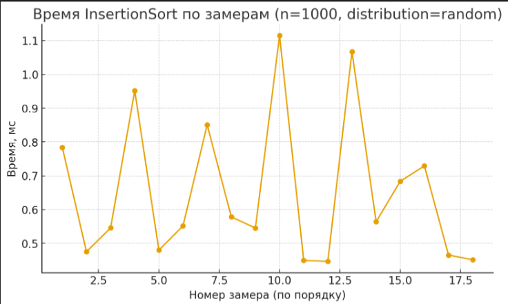
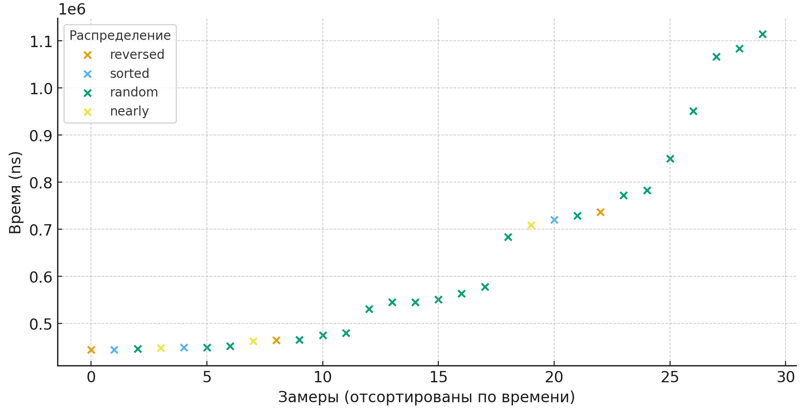

When I started this project, my goal was not just to implement insertion sort, but to demonstrate that even such a basic and well-known algorithm can be improved. 
The classic version of insertion sort is intuitive: we take elements one by one and place them into the already sorted part of the array. 
However, it has a weakness — on large arrays, especially random or reversed ones, it becomes too slow.

To address this, I introduced several optimizations. The first was binary search for the insertion position. 
Instead of checking step by step, binary search quickly finds the correct spot in logarithmic time. The second optimization was the use of a sentinel element. 
By moving the minimum value to the beginning of the array, we avoid unnecessary boundary checks, which makes the algorithm both faster and cleaner. 
Finally, the third optimization was using System.arraycopy to shift entire blocks of elements in a single call, rather than moving them one by one.

But the algorithm itself was only part of the story. To truly understand its efficiency, 
I built a performance tracker that records not only execution time but also the number of comparisons, swaps, reads, and writes. With this, 
I could see a much clearer picture of how the algorithm behaves under different conditions.

I ran experiments on arrays of one thousand elements, testing various input types: sorted, nearly sorted, random, and completely reversed. 
The results revealed a striking contrast. On sorted arrays, insertion sort works almost perfectly — execution time grows nearly linearly because very little 
rearranging is needed. On random arrays, it shows its typical quadratic nature, but even here the optimizations reduce the number of operations. On reversed arrays, 
however, the algorithm reveals its worst case: despite the optimizations, the time remains quite large.

In the end, this project demonstrated that even a simple algorithm can behave very differently depending on its implementation. 
In the end, this project demonstrated that even a simple algorithm can behave very differently depending on its implementation. 
The optimizations did not change its asymptotic complexity, but they made it faster and more practical. For me, it was a valuable lesson: 
it is not enough to know an algorithm in theory; one must also explore how to refine it and how to measure its real-world performance.
